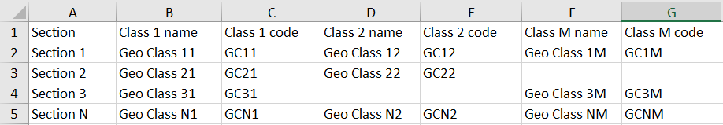
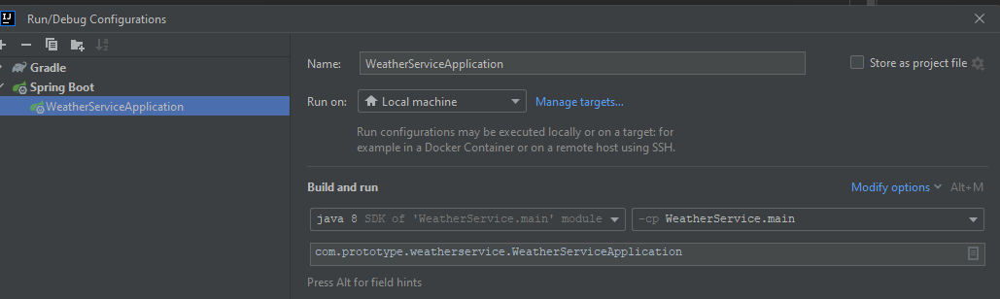

# NatlexService

Test task for backend developer by Natlex.

Features:

- Async Importing .XLS files;
- Async Exporting .XLS files;
- REST Endpoint API.

# API

Example API Request and Response:

All requests must have an authorization token in the header.
`'Authorization' : 'token'`

```
GET http://localhost:8080/api/sections - Get a list of all Sections.
```
<details>
<summary>Json Response for api/sections</summary>
[
    {
        "name": "Section 1",
        "geologicalClasses": [
            {
                "name": "Geo Class 11",
                "code": "GC11"
            },
            {
                "name": "Geo Class 12",
                "code": "GC12"
            }
        ]
    },
    {
        "name": "Section 2",
        "geologicalClasses": [
            {
                "name": "Geo Class 21",
                "code": "GC21"
            },
            {
                "name": "Geo Class 22",
                "code": "GC22"
            }
        ]
    }
}
</details>

```
GET http://localhost:8080/api/sections/by-code?code=<code> - Get a list of all Sections that have geologicalClasses with the specified code. 
`code` - specified code. Required field.
```
<details>
<summary>Json Response for api/sections/by-code?code=GCN2</summary>
[
    {
        "name": "Section N",
        "geologicalClasses": [
            {
                "name": "Geo Class N1",
                "code": "GCN1"
            },
            {
                "name": "Geo Class N2",
                "code": "GCN2"
            },
            {
                "name": "Geo Class NM",
                "code": "GCNM"
            }
        ]
    }
}
</details>

```
POST http://localhost:8080/api/import/ - POST request with .xls file. Returns ID of the Async Job and launches importing .xls file.
Content-Type : multipart/form-data;
```
<details>
<summary>Json Response for POST api/import</summary>
{
    "id": 1
}
</details>

```
GET http://localhost:8080/api/import/{id} - returns result of importing by Job ID ("DONE", "IN_PROGRESS", "ERROR")
```
<details>
<summary>Json Response for api/import/{id}</summary>
{
    "id": 1,
    "type": "DONE"
}
</details>

```
GET http://localhost:8080/api/export/ - returns ID of the Async Job and launches exporting .xls file.
```
<details>
<summary>Json Response for api/api/export</summary>
{
    "id": 2,
    "type": "IN_PROGRESS"
}
</details>

```
GET http://localhost:8080/api/export/{id} - returns status progress of exporting by Job ID ("DONE", "IN_PROGRESS", "ERROR")
```
<details>
<summary>Json Response for api/export/{id}</summary>
{
    "id": 1,
    "type": "DONE"
}
</details>

```
GET http://localhost:8080/api/export/file/{id} - returns a file by Job ID (throw an exception with status 424(Failed Dependency) if exporting is in process or 404(Not Found) if Async Job was not launched)
```

Structure of file for importing and exporting:


# HOW TO RUN:

1. Clone this project;
2. Open/Import project in IDEA;
3. Create 'natlexservice' MySQL database for runtime;
4. Select 'NatlexServiceApplication' in Run/Debug Configurations and run.

[//]: # (4. Create 'natlexservicetest' MySQL database for test;)

If your IDE didn't generate it on its own when importing the project create SpringBoot run configuration manually:

`com.prototype.natlexservice.NatlexServiceApplication`

# Settings
Many settings, including database data, authorization token, can be found in `application.properties` for runtime 

[//]: # (and in `application-test.properties` for test.)
   